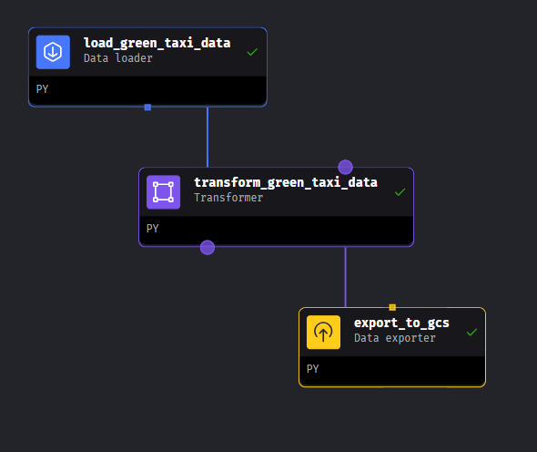

##  Nguồn dữ liệu đầu vào
TLC Trip Record Data: https://www.nyc.gov/site/tlc/about/tlc-trip-record-data.page. Với dữ liệu green taxi trip record năm 2022.

## Mage AI orchestration
- tạo pipeline với 3 khối: data loader, transformer, data exporter:

    * Data Loader (mage/data_loaders/load_green_taxi_data.py): Đọc dữ liệu parquet file từ urls
    * transformer (mage/transformers/transform_green_taxi_data.py): Chuyển đổi tên cột dữ liệu và loại bỏ dữ liệu passenger_count = 0
    * Data exporter (mage/data_exporters/export_to_gcs.py): Lưu dữ liệu vào trong gcs với bucket_name = 'green_taxi_2022' và object_key = '2022_taxi_data.parquet'

## Big Query
#### File greentaxi_bigquery.sql
- Tạo bảng external và bảng marterialized
- Truy vấn thông tin về nyc taxi trip data
- Tạo và so sánh các bảng partition, cluster
