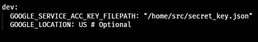

##  Nguồn dữ liệu đầu vào
TLC Trip Record Data: https://www.nyc.gov/site/tlc/about/tlc-trip-record-data.page. Với dữ liệu green taxi trip record năm 2022.

## Sử dụng Mage AI orchestration để chuyển đổi 
### Bước 1
git clone https://github.com/mage-ai/compose-quickstart.git mage-orchestration \
&& cd mage-quickstart \
&& cp dev.env .env \

- Chỉnh sửa file .env
==> docker compose up

### Bước 2
- Mở Browser với http://localhost:6789
- Điều chỉnh io_config.yaml với profile riêng

- tạo pipeline với 3 khối: data loader, tranformer, data exporter:

